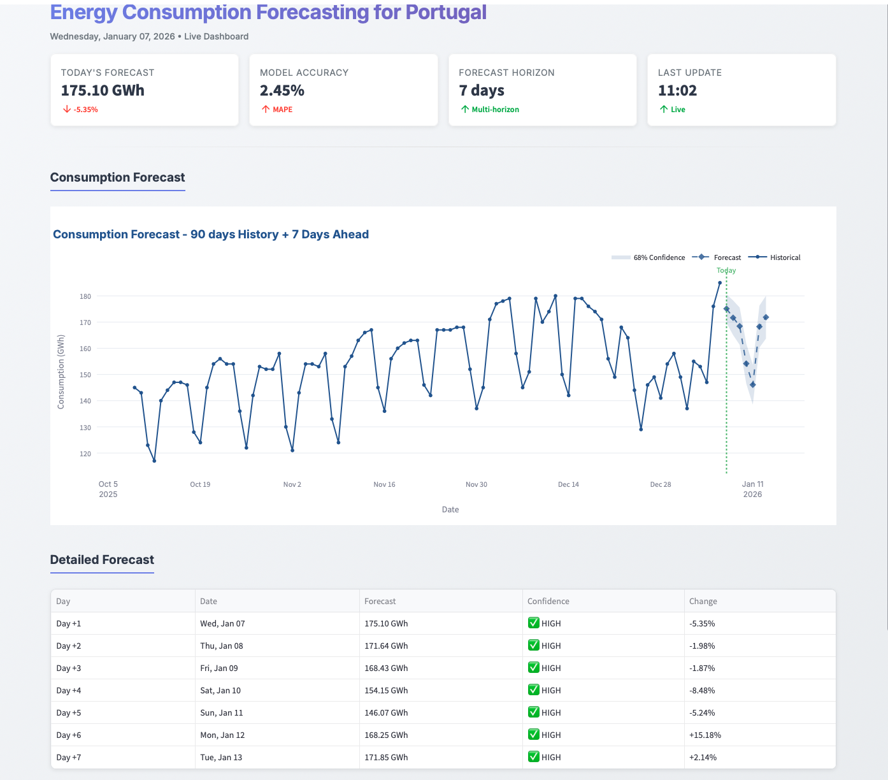
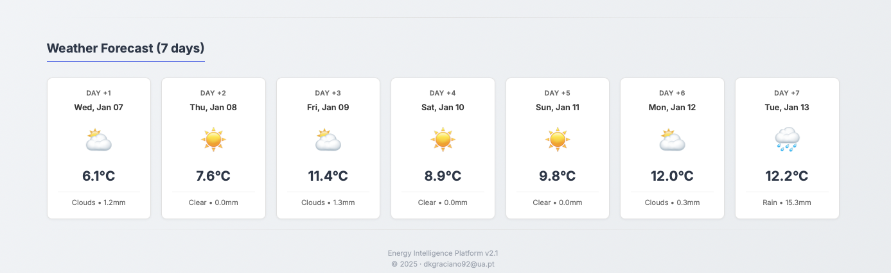
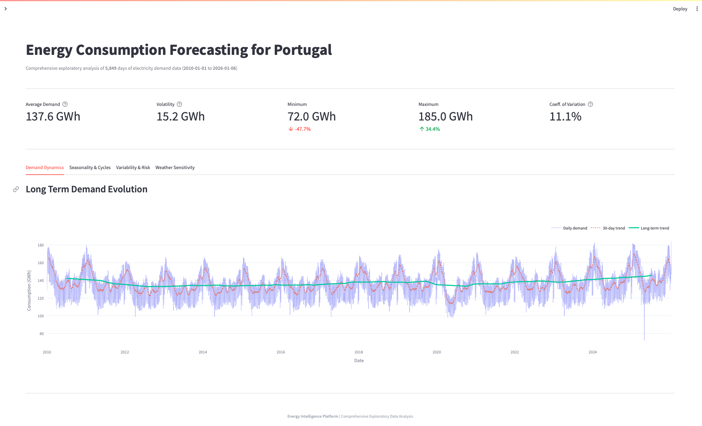
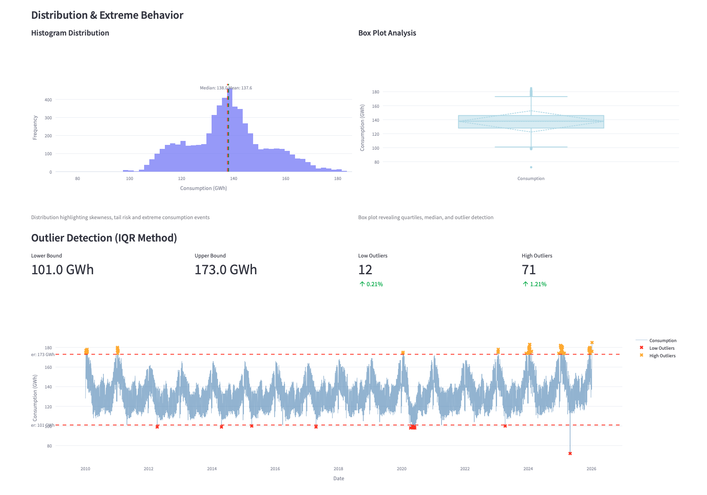
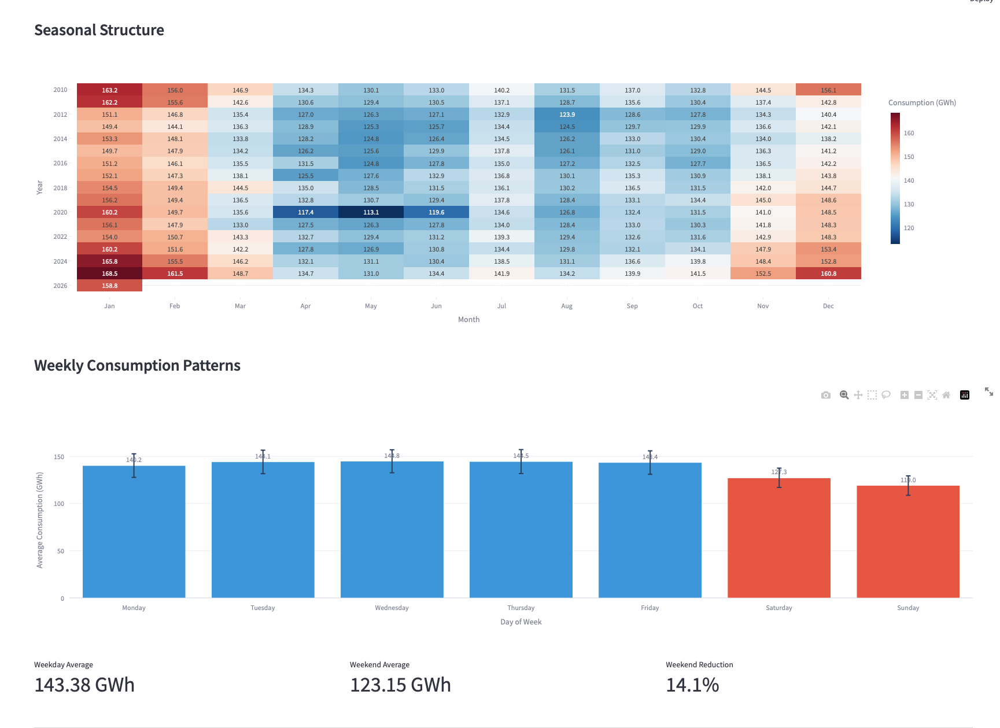

# Energy Consumption Forecasting for Portugal Using Ensemble Machine Learning

> Our system for daily energy consumption forecasting in Portugal, achieving **MAPE 2.43%**, with automated pipeline, REST API and interactive dashboard.
<div align="center">


</div>

---

## Table of Contents

- [Overview](#-overview)
- [Features](#-features)
- [Architecture](#-architecture)
- [Quick Start](#-quick-start)
- [Dashboard](#-dashboard)
- [Model Performance](#-model-performance)
- [Project Structure](#-project-structure)
- [Technologies](#-technologies)
- [Daily Pipeline](#-daily-pipeline)
 
 

---

## Overview 

**Energy Consumption Forecasting for Portugal** is a complete end to end machine learning system that predicts electricity demand for Portugal with **89.1% accuracy** ($R^2$=0.891). The system combines competition based model selection with real-time weather forecasts to deliver precise predictions up to 7 days ahead.

### Key Highlights

- **Global performance** in energy forecasting (MAPE 2.43%)
- **7- day multi-horizon forecasting** with confidence intervals
- **Portuguese holiday detection** for improved accuracy
- **Weather-aware predictions** via Open-Meteo API integration
- **Professional dashboard** built with Streamlit
- **Production REST API** with FastAPI and smart caching
- **Automated daily pipeline** for data updates and retraining
- **15+ years historical data** (2010-2025)

---

## Features

### Core Capabilities

| Feature | Description |
|---------|-------------|
| **Multi-horizon Forecasting** | Predict 1-7 days ahead with individual confidence levels |
| **Model Competition** | 3 models per horizon (RandomForest, LightGBM, XGBoost) - best wins |
| **Weather Integration** | Real-time weather forecasts for enhanced accuracy |
| **Confidence Intervals** | 68% and 95% prediction intervals based on MAE |
| **Smart Feature Selection** | SHAP-based selection of top 30 features |
| **Portuguese Holidays** | Complete national holiday detection + bridge days |
| **Professional Dashboard** | Real-time visualization with Streamlit |
| **REST API** | FastAPI endpoints with TTL caching (5min) |
| **Automated Pipeline** | Daily data collection, training, and prediction |

### Prediction Accuracy by Horizon

| Horizon | RMSE | $R^2$ | MAE | MAPE | Confidence |
|---------|------|-----|-----|------|------------|
| **Day +1** | 5.47 | **0.891** | 3.43 | **2.43%** | HIGH |
| **Day +2** | 6.45 | 0.848 | 4.56 | 3.20% | HIGH |
| **Day +3** | 7.04 | 0.820 | 4.98 | 3.49% | MEDIUM  |
| **Day +4** | 7.26 | 0.808 | 5.26 | 3.68% | MEDIUM  |
| **Day +5** | 7.35 | 0.803 | 5.30 | 3.70% | MEDIUM  |
| **Day +6** | 7.29 | 0.807 | 5.23 | 3.66% | MEDIUM  |
| **Day +7** | 7.57 | 0.793 | 5.54 | 3.85% | MEDIUM |

> **Benchmark**: MAPE < 3% = Excellent | 3-5% = Good | >5% = Reasonable (Lewis, 1982)

---

 


**Key Metrics Display:**
- Today's forecast with percentage change vs. last known value
- Model accuracy (MAPE 2.43%)
- 7-day forecast horizon
- Real-time update timestamp

**Interactive Features:**
- Historical consumption chart (90 days)
- 7 day forecast with confidence bands
- Detailed forecast table with day by day breakdown
- Weather conditions for next 7 days (horizontal cards)

### API Response Example

```bash
curl http://localhost:8000/energy/forecast/7
```

```json
{
  "last_known": {
    "date": "2025-12-16",
    "consumption": 179.0
  },
  "predictions": {
    "day_1": {
      "date": "2025-12-17",
      "predicted": 169.75,
      "weather": {
        "date": "2025-12-17",
        "temperatura": 10.0,
        "radiacao_solar": 8.4,
        "humidade": 86,
        "chuva": 0.0,
        "vento": 11.0
      },
      "metrics": {
        "RMSE": 5.47,
        "MAE": 3.43,
        "MAPE": 2.43,
        "R2": 0.891
      }
    },
    "day_2": {
      "date": "2025-12-18",
      "predicted": 165.38,
      "weather": { "..." },
      "metrics": { "..." }
    }
  },
  "generated_at": "2025-12-17T23:40:31.241591"
}
```

---

## Architecture

```
┌─────────────────────────────────────────────────────────────┐
│                    DATA COLLECTION                          │
│ REN API (Consumption, Production) + Weather API(Open-Meteo) │
└───────────────────────────┬─────────────────────────────────┘
                            │
                            ▼
┌─────────────────────────────────────────────────────────────┐
│                 FEATURE ENGINEERING                         │
│  - 30 engineered features via SHAP selection                │
│  - Time features (weekday, month, holidays)                 │
│  - Lag features (1-30 days)                                 │
│  - Rolling statistics (3, 7, 14, 30 days)                   │
│  - Weather features + interactions                          │
│  - Portuguese national holidays + bridge days               │
└───────────────────────────┬─────────────────────────────────┘
                            │
                            ▼
┌─────────────────────────────────────────────────────────────┐
│                   MODEL TRAINING                            │
│  1. Model Competition (per horizon):                        │
│    - RandomForest                                           │
│    - LightGBM                                               │
│    - XGBoost                                                │
│  2. Best model selected based on RMSE                       │
│  3. 7 independent models (direct forecasting)               │
│  4. Cross-validation + performance tracking                 │
└──────────────────────────┬──────────────────────────────────┘
                           │
                           ▼
┌─────────────────────────────────────────────────────────────┐
│                   PREDICTION LAYER                          │
│  FastAPI REST API + Streamlit Dashboard                     │
│  - Multi-horizon predictions (1-7 days)                     │
│  - Confidence intervals (68%, 95%)                          │
│  - Weather integration                                      │
│  - Smart caching (TTL 5min)                                 │
└─────────────────────────────────────────────────────────────┘
```

### Data Flow

1. **Collection**: Download incremental data from REN API + weather forecasts
2. **Processing**: Transform raw data + create 30 engineered features
3. **Training** : Competition-based selection per horizon (weekly retrain)
4. **Prediction** : Generate 7 day forecast with confidence intervals
5. **Serving** : API endpoints + Dashboard visualization

---


### REST API

```bash
# Get today's forecast
curl http://localhost:8000/energy/predict-next

# Get 7-day forecast
curl http://localhost:8000/energy/forecast/7

# Get weather forecast
curl http://localhost:8000/weather/forecast/7

# Health check
curl http://localhost:8000/health

# Model information
curl http://localhost:8000/model/info
```

---

## API Documentation

### Energy Endpoints

| Method | Endpoint | Description | Response |
|--------|----------|-------------|----------|
| GET | `/energy/predict-next` | Get tomorrow's forecast | Single day prediction |
| GET | `/energy/forecast/{days}` | Multi-day forecast (1-7) | 7-day predictions with weather |

**Example Response:**
```json
{
  "status": "success",
  "prediction": {
    "predicted": 169.75,
    "date": "2025-12-17",
    "weather": {...},
    "metrics": {...},
    "confidence_interval": {
      "lower": 166.32,
      "upper": 173.18
    }
  }
}
```

### Weather Endpoints

| Method | Endpoint | Description |
|--------|----------|-------------|
| GET | `/weather/current` | Current weather conditions |
| GET | `/weather/forecast/{days}` | Weather forecast (1-16 days) |

### System Endpoints

| Method | Endpoint | Description |
|--------|----------|-------------|
| GET | `/` | API information + available endpoints |
| GET | `/health` | Service health check |
| GET | `/model/info` | Model details & performance metrics |

---

### Dashboard Interface

The Streamlit dashboard provides real-time visualization of predictions and system status.






### Access Dashboard
```bash
streamlit run dashboard/app.py
```

Navigate to **http://localhost:8501**

---

## Model Performance

### Overall Metrics

| Metric | Day +1 | Day +2 | Day +3 | Day +7 | Average |
|--------|--------|--------|--------|--------|---------|
| **RMSE (GWh)** | 5.47 | 6.45 | 7.04 | 7.57 | 6.78 |
| **$R^2$ Score** | 0.891 | 0.848 | 0.820 | 0.793 | 0.838 |
| **MAE (GWh)** | 3.43 | 4.56 | 4.98 | 5.54 | 4.88 |
| **MAPE (%)** | **2.43** | 3.20 | 3.49 | 3.85 | 3.24 |

**Interpretation:**
- **MAPE 2.43%** = Excellent forecast quality (Lewis, 1982)
- **$R^2$ 0.891** = Model explains 89.1% of variance
- **MAE 3.43 GWh** = Average error of ~3.4 GWh (~2% of typical consumption)

**Performance Classification (Lewis, 1982):**
- MAPE < 10% = Highly accurate
- MAPE < 20% = Good
- MAPE < 50% = Reasonable
- MAPE ≥ 50% = Inaccurate


### Confidence Intervals

Prediction intervals based on MAE: 
- **68% interval**: $\pm$ × MAE (e.g., Day+1: $\pm$ 3.43 GWh)
- **95% interval**: $\pm$ 1.96 × MAE (e.g., Day+1: $\pm$ 6.72 GWh)

**Example Interpretation:**
```
Prediction: 169.75 GWh
68% interval: [166.32, 173.18] GWh  -> 68% chance actual is in this range
95% interval: [162.99, 176.51] GWh  -> 95% chance actual is in this range
```

### Model Architecture

**Competition Based Selection:**
- 3 candidate models per horizon:
  - **RandomForest**: Robust, handles non linearity
  - **LightGBM**: Fast, memory efficient
  - **XGBoost**: High accuracy, gradient boosting
- Best model selected based on RMSE validation
- Total: **7 models** (one per horizon)

**Direct Forecasting Approach:**
- Independent model for each horizon (h1-h7)
- No error propagation between days
- Industry-standard approach (80% of energy forecasting)
- Each model optimized for specific forecast distance

**Why not recursive?**
- Recursive: Uses previous predictions as inputs → error compounds
- Direct: Independent predictions → no error propagation
- Direct is proven superior for energy forecasting (Hong et al., 2016)

### Feature Selection

**SHAP-Based Selection:**
- Analyzed 55 engineered features
- Selected top 30 based on SHAP importance
- Balanced importance across feature categories:
  - Lag features: 40%
  - Rolling statistics: 30%
  - Weather: 20%
  - Time/Holiday: 10%

**Holiday Impact:**
- Holidays reduce consumption by ~15-25%
- Bridge days reduce by ~8-12%
- Adding holidays improved MAPE by **3-5%**

**Additional Features:**
- **Bridge Days**: Days between holidays and weekends
- **Example**: Thursday before Friday holiday
- **Impact**: Improves holiday adjacent predictions by 3-5%

---

### Data Sources

- **REN (Redes Energéticas Nacionais)** - Electricity consumption and  production
  - API: https://www.ren.pt/consumo-e-producao
  - Update frequency: Hourly (aggregated daily)
  - Historical data: 2010 - present

- **Open-Meteo API** - Weather forecasts
  - API: https://open-meteo.com/
  - Variables: Temperature, radiation, humidity, rain, wind
  - Forecast range: 16 days

---

##  Daily Pipeline

### Automated Updates

The system includes a daily automated pipeline for continuous operation:

```bash
bash ./scripts/daily_pipeline.sh
```

**Pipeline Steps:**

1. **Data Collection** (Daily  Mon-Sun)
   - Incremental download from REN API
   - Fetch weather forecast for next 7 days
   - Update `dataset_base.csv` and `dataset_production.csv`
   - **Duration**: ~30 seconds

2. **Feature Engineering** (Daily  Mon-Sun)
   - Process new data points
   - Generate 30 features
   - Update `dataset_trainer_final.csv` and `dataset_production_final.csv`
   - **Duration**: ~10 seconds

3. **Model Training** (Weekly  Monday only)
   - Retrain all 7 models (competition per horizon)
   - Update model registry with new metrics
   - Promote best models to production
   - **Duration**: ~2 minutes

4. **Prediction** (Daily  Mon-Sun)
   - Generate 7-day forecast
   - Update `latest_prediction.json`
   - Refresh dashboard data
   - **Duration**: <1 second
---


## Author

**Domingos Kaquepa Luciano Graciano**

-  Email: dkgraciano92@ua.pt
-  Institution: University of Aveiro
-  Program: Specialization Program in Machine Learning and Data Analysis
-  LinkedIn: [Domingos Graciano](https://www.linkedin.com/in/domingos-graciano)
-  GitHub: [@kaquepa](https://github.com/kaquepa)

---

## Roadmap

### Completed

- [x] Historical data collection (2010-2025)
- [x] Feature engineering pipeline (30 features)
- [x] Multi-horizon forecasting (7 days)
- [x] Model competition (RandomForest, LightGBM, XGBoost)
- [x] Confidence interval calculation (68%, 95%)
- [x] Portuguese holiday detection + bridge days
- [x] REST API with FastAPI
- [x] Professional Streamlit dashboard
- [x] Automated daily pipeline
- [x] Weather integration (Open-Meteo)
- [x] Smart caching (TTL 5min)

---

<div align="center">
 

Made  by [Domingos Graciano](https://github.com/kaquepa)
</div>